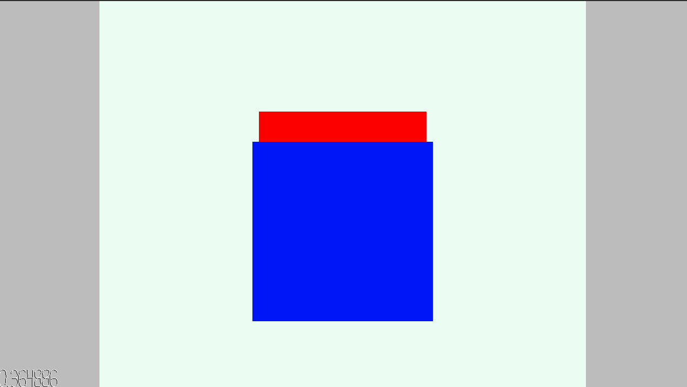

# "I'm sure that you can get a sound game done in two and a half hours" --Jim McCann

Author: Aren Davey

Design: Using the doppler effect, try your best to land the cube on the target. A lower score is better

Screen Shot:

How To Play:

press space to stop the target (click on the game to focus the window first)

This game was built with [NEST](NEST.md).
